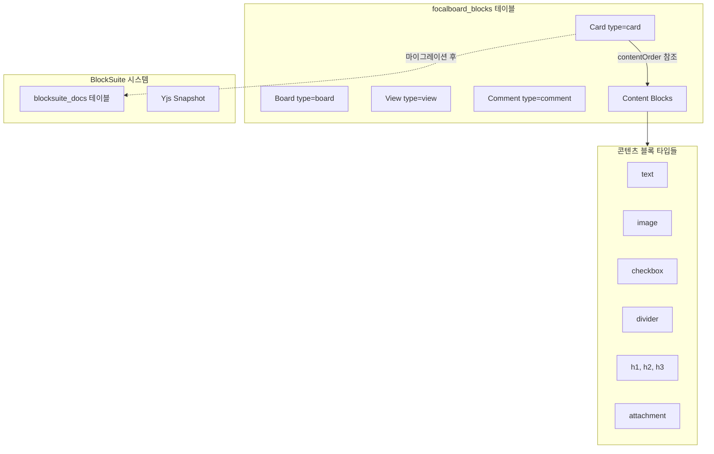

# Focalboard 블록 시스템 제거 계획

## 1. 분석 결과: 제거 가능 여부

### 1.1 블록 시스템 구조



### 1.2 제거 가능/불가능 구분

| 구분 | 항목 | 제거 가능 | 이유 |

|------|------|----------|------|

| **콘텐츠 블록** | text, image, checkbox, divider, h1-h3, attachment, video, quote, list | **가능** | BlockSuite가 완전히 대체 |

| **구조 블록** | board, view, card | **불가능** | 핵심 데이터 모델, 독립 테이블 없음 |

| **코멘트 블록** | comment | **부분적** | 별도 테이블 이관 시 가능 |

### 1.3 현재 의존성 분석

**콘텐츠 블록을 사용하는 주요 파일 (47개):**

- [webapp/src/components/contentBlock.tsx](webapp/src/components/contentBlock.tsx) - 콘텐츠 블록 렌더링
- [webapp/src/components/content/](webapp/src/components/content/) - 개별 블록 요소들
- [webapp/src/components/cardDetail/cardDetailContents.tsx](webapp/src/components/cardDetail/cardDetailContents.tsx) - 카드 상세 콘텐츠
- [webapp/src/store/contents.ts](webapp/src/store/contents.ts) - 콘텐츠 Redux 스토어
- [webapp/src/mutator.ts](webapp/src/mutator.ts) - 블록 CRUD 작업

---

## 2. 제거 전략: 3단계 접근

### Phase 1: 콘텐츠 블록 시스템 비활성화 (저위험)

BlockSuite가 이미 적용되어 콘텐츠 블록 UI가 사용되지 않으므로, 관련 코드를 점진적으로 정리합니다.

**대상 파일 (웹앱):**

```
webapp/src/
├── blocks/
│   ├── textBlock.ts          # 삭제
│   ├── imageBlock.ts         # 삭제
│   ├── checkboxBlock.ts      # 삭제
│   ├── dividerBlock.ts       # 삭제
│   ├── h1Block.tsx           # 삭제
│   ├── h2Block.tsx           # 삭제
│   ├── h3Block.tsx           # 삭제
│   ├── attachmentBlock.tsx   # 삭제
│   └── contentBlock.ts       # 삭제
├── components/
│   ├── contentBlock.tsx      # 삭제
│   ├── contentBlock.scss     # 삭제
│   ├── addContentMenuItem.tsx # 삭제 (BlockSuite 슬래시 메뉴로 대체)
│   └── content/
│       ├── textElement.tsx       # 삭제
│       ├── imageElement.tsx      # 삭제
│       ├── checkboxElement.tsx   # 삭제
│       ├── dividerElement.tsx    # 삭제
│       ├── contentElement.tsx    # 삭제
│       └── contentRegistry.tsx   # 삭제
├── components/cardDetail/
│   ├── cardDetailContents.tsx    # 리팩토링 (BlockSuite만 사용)
│   ├── cardDetailContentsMenu.tsx # 삭제
│   └── imagePaste.tsx            # 삭제 (BlockSuite가 처리)
└── store/
    └── contents.ts               # 삭제
```

### Phase 2: Card.contentOrder 필드 제거 (중위험)

`contentOrder` 필드는 레거시 블록 순서를 저장하는데, BlockSuite 마이그레이션 완료 후 불필요합니다.

**수정 필요 파일:**

- [server/model/card.go](server/model/card.go) - `ContentOrder []string` 필드 제거
- [webapp/src/blocks/card.ts](webapp/src/blocks/card.ts) - `contentOrder` 필드 제거
- 마이그레이션 로직에서 contentOrder 참조 제거

**주의:** 마이그레이션이 완료된 카드만 대상으로 해야 함

### Phase 3: 서버 API 및 DB 정리 (고위험)

**콘텐츠 블록 전용 API 제거:**

- [server/api/content_blocks.go](server/api/content_blocks.go) - 전체 삭제
- [server/app/content_blocks.go](server/app/content_blocks.go) - 전체 삭제

**blocks API 축소:**

- [server/api/blocks.go](server/api/blocks.go) - card/view/comment 외 타입 거부
- [server/app/blocks.go](server/app/blocks.go) - 콘텐츠 블록 관련 로직 제거

**DB 정리 (선택적):**

```sql
-- 콘텐츠 블록 데이터 삭제 (마이그레이션 완료 확인 후)
DELETE FROM focalboard_blocks 
WHERE type IN ('text', 'image', 'checkbox', 'divider', 'h1', 'h2', 'h3', 'attachment', 'video', 'quote');

-- blocks_history에서도 정리 (선택적)
DELETE FROM focalboard_blocks_history 
WHERE type IN ('text', 'image', 'checkbox', 'divider', 'h1', 'h2', 'h3', 'attachment', 'video', 'quote');
```

---

## 3. 코멘트 시스템 처리

코멘트는 현재 블록 테이블에 `type=comment`로 저장됩니다. 두 가지 옵션이 있습니다:

### Option A: 블록 테이블에 유지 (권장)

- 변경 최소화
- 기존 코드 재사용
- 코멘트만 블록 API 사용 유지

### Option B: 별도 테이블로 이관

- 새 `focalboard_comments` 테이블 생성
- 마이그레이션 스크립트 작성
- API 및 앱 레이어 수정
- 더 깔끔한 아키텍처지만 작업량 많음

---

## 4. 제거 불가능한 항목

다음은 블록 테이블에 의존하므로 **제거 불가**:

| 항목 | 이유 |

|------|------|

| `focalboard_blocks` 테이블 | board, view, card, comment 저장 |

| `focalboard_blocks_history` 테이블 | 이력 관리 |

| [server/model/block.go](server/model/block.go) | 핵심 모델 |

| [webapp/src/blocks/block.ts](webapp/src/blocks/block.ts) | 기본 블록 타입 |

| [webapp/src/blocks/card.ts](webapp/src/blocks/card.ts) | 카드 타입 |

| [webapp/src/blocks/boardView.ts](webapp/src/blocks/boardView.ts) | 뷰 타입 |

| [webapp/src/blocks/board.ts](webapp/src/blocks/board.ts) | 보드 타입 |

| [webapp/src/blocks/commentBlock.ts](webapp/src/blocks/commentBlock.ts) | 코멘트 타입 |

---

## 5. 권장 실행 순서

1. **마이그레이션 완료 확인** - 모든 카드가 BlockSuite로 마이그레이션 되었는지 확인하는 도구 작성
2. **Phase 1 실행** - 웹앱 콘텐츠 블록 코드 제거 (UI 영향 없음)
3. **테스트** - 기존 기능 정상 동작 확인
4. **Phase 2 실행** - contentOrder 필드 제거
5. **Phase 3 실행** - 서버 API 정리
6. **DB 정리** - 콘텐츠 블록 데이터 삭제

---

## 6. 예상 효과

| 항목 | 감소량 |

|------|--------|

| 웹앱 코드 | ~40개 파일, ~3,000줄 |

| 서버 코드 | ~4개 파일, ~500줄 |

| DB 데이터 | 콘텐츠 블록 수 × 평균 블록 크기 |

| 번들 크기 | ~50KB (추정) |

| 복잡도 | 이중 에디터 시스템 제거 |