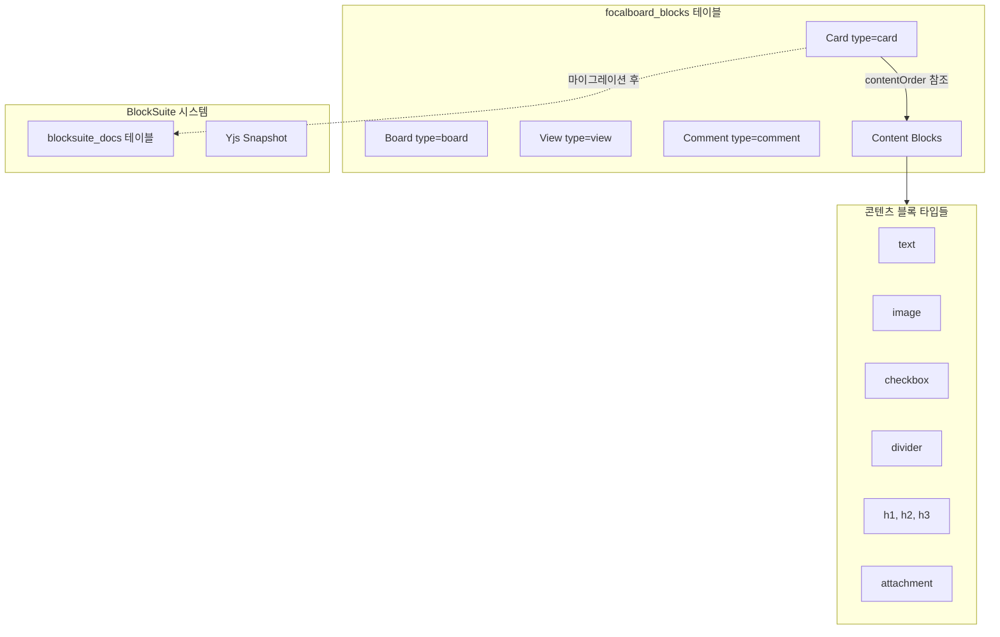

# Focalboard 블록 시스템 제거 계획

## 1. 분석 결과: 제거 가능 여부

### 1.1 블록 시스템 구조



### 1.2 제거 가능/불가능 구분

| 구분 | 항목 | 제거 가능 | 이유 |

|------|------|----------|------|

| **콘텐츠 블록** | text, image, checkbox, divider, h1-h3, attachment, video, quote | **가능** | BlockSuite가 완전히 대체 |

| **구조 블록** | board, view, card | **불가능** | 핵심 데이터 모델, 독립 테이블 없음 |

| **코멘트 블록** | comment | **부분적** | 별도 테이블 이관 시 가능 |

### 1.3 현재 의존성 분석

**콘텐츠 블록을 사용하는 주요 파일 (47개):**

- [webapp/src/components/contentBlock.tsx](webapp/src/components/contentBlock.tsx) - 콘텐츠 블록 렌더링
- [webapp/src/components/content/](webapp/src/components/content/) - 개별 블록 요소들
- [webapp/src/components/cardDetail/cardDetailContents.tsx](webapp/src/components/cardDetail/cardDetailContents.tsx) - 카드 상세 콘텐츠
- [webapp/src/store/contents.ts](webapp/src/store/contents.ts) - 콘텐츠 Redux 스토어
- [webapp/src/mutator.ts](webapp/src/mutator.ts) - 블록 CRUD 작업

### 1.4 중요: contentOrder 중첩 구조

`contentOrder`가 단순 `string[]`이 아닌 **`Array<string | string[]>`** 구조입니다:

```typescript
// webapp/src/blocks/card.ts:11
contentOrder: Array<string | string[]>

// 실제 사용 예 (cardDetailContents.tsx:86-92)
for (const contentId of card.fields.contentOrder) {
    if (typeof contentId === 'string') {
        contentOrder.push(contentId)
    } else {
        contentOrder.push(contentId.slice())  // 중첩 배열 처리 (병렬 블록)
    }
}
```

이 중첩 구조는 **병렬 블록 레이아웃**을 위한 것으로, 제거 시 이 기능의 대체 방안이 필요합니다.

---

## 2. 제거 전략: 4단계 접근 (Phase 0 추가)

### Phase 0: 마이그레이션 완료 검증 (1-2일) [신규]

Phase 1 진행 전 필수 검증 단계입니다.

**검증 스크립트:**

```sql
-- 1. BlockSuite 문서가 없는 카드 확인
SELECT c.id, c.title 
FROM focalboard_blocks c 
WHERE c.type = 'card' 
  AND c.delete_at = 0
  AND c.id NOT IN (SELECT card_id FROM focalboard_blocksuite_docs);

-- 2. 콘텐츠 블록이 있지만 BlockSuite 문서가 없는 카드
SELECT DISTINCT parent_id 
FROM focalboard_blocks 
WHERE type IN ('text', 'image', 'checkbox', 'divider', 'h1', 'h2', 'h3')
  AND delete_at = 0
  AND parent_id NOT IN (SELECT card_id FROM focalboard_blocksuite_docs);

-- 3. 마이그레이션 통계
SELECT 
    (SELECT COUNT(*) FROM focalboard_blocks WHERE type = 'card' AND delete_at = 0) as total_cards,
    (SELECT COUNT(*) FROM focalboard_blocksuite_docs) as migrated_cards,
    (SELECT COUNT(*) FROM focalboard_blocks WHERE type IN ('text', 'image', 'checkbox', 'divider', 'h1', 'h2', 'h3') AND delete_at = 0) as legacy_content_blocks;
```

**롤백 환경 구축:**

- 테스트 환경에서 롤백 시뮬레이션 실행
- 각 Phase별 롤백 절차 문서화

### Phase 1: 콘텐츠 블록 시스템 비활성화 (3-5일)

BlockSuite가 이미 적용되어 콘텐츠 블록 UI가 사용되지 않으므로, 관련 코드를 점진적으로 정리합니다.

#### Phase 1A: UI 렌더링 분리 (저위험)

```
├── CardDetail에서 레거시 렌더링 조건부 제거
├── newBoardsEditor 플래그 기본값 true 확인
└── 테스트 환경에서 검증
```

**Feature Flag 활용:**

```typescript
// 현재 코드 (cardDetail.tsx:83)
const newBoardsEditor = clientConfig?.featureFlags?.newBoardsEditor ?? true
```

#### Phase 1B: 콘텐츠 블록 코드 제거 (중위험)

**대상 파일 (웹앱):**

```
webapp/src/
├── blocks/
│   ├── textBlock.ts          # 삭제
│   ├── imageBlock.ts         # 삭제
│   ├── checkboxBlock.ts      # 삭제
│   ├── dividerBlock.ts       # 삭제
│   ├── h1Block.tsx           # 삭제
│   ├── h2Block.tsx           # 삭제
│   ├── h3Block.tsx           # 삭제
│   ├── attachmentBlock.tsx   # 삭제
│   └── contentBlock.ts       # 삭제
├── components/
│   ├── contentBlock.tsx      # 삭제
│   ├── contentBlock.scss     # 삭제
│   ├── addContentMenuItem.tsx # 삭제 (BlockSuite 슬래시 메뉴로 대체)
│   └── content/
│       ├── textElement.tsx       # 삭제
│       ├── imageElement.tsx      # 삭제
│       ├── checkboxElement.tsx   # 삭제
│       ├── dividerElement.tsx    # 삭제
│       ├── contentElement.tsx    # 삭제
│       └── contentRegistry.tsx   # 삭제
├── components/cardDetail/
│   ├── cardDetailContents.tsx    # 리팩토링 (BlockSuite만 사용)
│   ├── cardDetailContentsMenu.tsx # 삭제
│   └── imagePaste.tsx            # 삭제 (BlockSuite가 처리)
└── store/
    └── contents.ts               # 삭제
```

#### Phase 1C: Gallery/Unfurl 대체 구현 (중위험) [신규]

**위험 요소 발견:**

```typescript
// galleryCard.tsx:64-69 - 이미지 블록 직접 조회
const image: ContentBlock|undefined = useMemo(() => {
    return (contents[i] as ContentBlock[]).find((c) => c.type === 'image')
}, [contents])

// boardsUnfurl.tsx:96-108 - 첫 번째 콘텐츠 블록 조회
let [firstContentBlockID] = firstCard.fields?.contentOrder
const contentBlock = await octoClient.getBlocksWithBlockID(firstContentBlockID, boardID, readToken)
```

**대체 구현 필요:**

- BlockSuite 문서에서 첫 이미지 추출 로직 구현
- Unfurl 미리보기 BlockSuite 기반으로 변경

### Phase 2: Card.contentOrder 필드 제거 (1-2일, 중위험)

`contentOrder` 필드는 레거시 블록 순서를 저장하는데, BlockSuite 마이그레이션 완료 후 불필요합니다.

**수정 필요 파일:**

- [server/model/card.go](server/model/card.go) - `ContentOrder []string` 필드 제거
- [webapp/src/blocks/card.ts](webapp/src/blocks/card.ts) - `contentOrder` 필드 제거
- 마이그레이션 로직에서 contentOrder 참조 제거
- **MoveContentBlock API 제거** (server/app/content_blocks.go)

**Import/Export 하위 호환성:**

```go
// Import 시 contentOrder 필드 무시 (에러 발생 방지)
if _, ok := cardFields["contentOrder"]; ok {
    delete(cardFields, "contentOrder") // 조용히 무시
}
```

**주의:** 마이그레이션이 완료된 카드만 대상으로 해야 함

### Phase 3: 서버 API 및 DB 정리 (2-3일, 고위험)

**콘텐츠 블록 전용 API 제거:**

- [server/api/content_blocks.go](server/api/content_blocks.go) - 전체 삭제
- [server/app/content_blocks.go](server/app/content_blocks.go) - 전체 삭제

**blocks API 축소:**

- [server/api/blocks.go](server/api/blocks.go) - card/view/comment 외 타입 거부
- [server/app/blocks.go](server/app/blocks.go) - 콘텐츠 블록 관련 로직 제거

**legacyConverter.ts 제거:**

```typescript
// webapp/src/components/blockSuite/legacyConverter.ts
// 마이그레이션 중에만 필요 - Phase 3 완료 후 제거
export function convertLegacyBlocksToDocSnapshot(blocks: Block[], card: Card): DocSnapshot
```

**DB 정리 (Phase 3+ : 1개월 모니터링 후):**

```sql
-- 콘텐츠 블록 데이터 삭제 (마이그레이션 완료 확인 후)
DELETE FROM focalboard_blocks 
WHERE type IN ('text', 'image', 'checkbox', 'divider', 'h1', 'h2', 'h3', 'attachment', 'video', 'quote');

-- blocks_history에서도 정리 (선택적)
DELETE FROM focalboard_blocks_history 
WHERE type IN ('text', 'image', 'checkbox', 'divider', 'h1', 'h2', 'h3', 'attachment', 'video', 'quote');
```

---

## 3. 롤백 전략 [신규 섹션]

### Phase 1 롤백

```bash
# Git에서 삭제된 파일 복원
git checkout HEAD~1 -- webapp/src/blocks/textBlock.ts ...
# 또는
git revert <commit-hash>
```

### Phase 2 롤백

1. `contentOrder` 필드 코드 복원 (git revert)
2. DB 마이그레이션 롤백 (필요시)

### Phase 3 롤백

1. API 파일 복원 (git revert)
2. DB 데이터 복원 (백업에서)

**중요:** 각 Phase 시작 전 DB 백업 필수

```bash
# PostgreSQL 백업 예시
pg_dump -t focalboard_blocks -t focalboard_blocks_history dbname > backup.sql
```

---

## 4. 코멘트 시스템 처리

코멘트는 현재 블록 테이블에 `type=comment`로 저장됩니다. 두 가지 옵션이 있습니다:

### Option A: 블록 테이블에 유지 (권장)

- 변경 최소화
- 기존 코드 재사용
- 코멘트만 블록 API 사용 유지

### Option B: 별도 테이블로 이관

- 새 `focalboard_comments` 테이블 생성
- 마이그레이션 스크립트 작성
- API 및 앱 레이어 수정
- 더 깔끔한 아키텍처지만 작업량 많음

---

## 5. 제거 불가능한 항목

다음은 블록 테이블에 의존하므로 **제거 불가**:

| 항목 | 이유 |

|------|------|

| `focalboard_blocks` 테이블 | board, view, card, comment 저장 |

| `focalboard_blocks_history` 테이블 | 이력 관리 |

| [server/model/block.go](server/model/block.go) | 핵심 모델 |

| [webapp/src/blocks/block.ts](webapp/src/blocks/block.ts) | 기본 블록 타입 |

| [webapp/src/blocks/card.ts](webapp/src/blocks/card.ts) | 카드 타입 |

| [webapp/src/blocks/boardView.ts](webapp/src/blocks/boardView.ts) | 뷰 타입 |

| [webapp/src/blocks/board.ts](webapp/src/blocks/board.ts) | 보드 타입 |

| [webapp/src/blocks/commentBlock.ts](webapp/src/blocks/commentBlock.ts) | 코멘트 타입 |

---

## 6. 추가 고려 사항 [신규 섹션]

### 6.1 WebSocket 이벤트 처리

콘텐츠 블록 변경 시 WebSocket으로 브로드캐스트됩니다:

```go
// server/ws/plugin_adapter.go
a.wsAdapter.BroadcastBlockChange(teamID, block)
```

BlockSuite 전환 후에도 이 이벤트가 발생하는지, 클라이언트에서 어떻게 처리하는지 확인 필요합니다.

### 6.2 Undo/Redo 기능

레거시 시스템의 `mutator.ts`가 undo/redo를 처리합니다:

```typescript
// mutator.ts:347
async changeCardContentOrder(boardId, cardId, oldContentOrder, contentOrder, description)
```

BlockSuite는 자체 히스토리 관리가 있으므로, 이 부분의 전환이 매끄러운지 확인 필요합니다.

### 6.3 테스트 파일 업데이트

72개 파일에서 `contentOrder` 참조 중 상당수가 테스트 파일입니다:

```
- blockSuiteUtils.test.ts (10+ 참조)
- contentBlock.test.tsx
- cardDetailContents.test.tsx
- galleryCard.test.tsx
- table.test.tsx
```

테스트 업데이트 없이 제거하면 CI가 실패합니다.

---

## 7. 권장 실행 순서

| 순서 | 단계 | 예상 기간 | 위험도 |

|------|------|----------|--------|

| 1 | **Phase 0**: 마이그레이션 완료 검증 | 1-2일 | 낮음 |

| 2 | **Phase 1A**: UI 렌더링 분리 | 0.5일 | 낮음 |

| 3 | **Phase 1B**: 웹앱 콘텐츠 블록 코드 제거 | 1-2일 | 중간 |

| 4 | **Phase 1C**: Gallery/Unfurl 대체 구현 | 1-2일 | 중간 |

| 5 | **테스트**: 기존 기능 정상 동작 확인 | 1일 | - |

| 6 | **Phase 2**: contentOrder 필드 제거 | 1-2일 | 중간 |

| 7 | **Phase 3**: 서버 API 정리 | 2-3일 | 높음 |

| 8 | **모니터링**: 1개월 안정화 기간 | - | - |

| 9 | **Phase 3+**: DB 정리 | 0.5일 | 중간 |

**총 예상 기간:** 1-2주 (모니터링 기간 제외)

---

## 8. 에스컬레이션 트리거 [신규 섹션]

다음 상황 발생 시 계획 재검토 필요:

| 상황 | 대응 |

|------|------|

| 마이그레이션 안 된 카드가 10% 이상 | 강제 마이그레이션 배치 작업 필요 |

| Gallery/Unfurl 성능 저하 | BlockSuite 문서 파싱 최적화 또는 캐싱 필요 |

| Import/Export 호환성 문제 다수 발생 | 별도 마이그레이션 도구 개발 필요 |

| 롤백 필요 상황 발생 | 즉시 롤백 후 원인 분석, 계획 재수립 |

---

## 9. 예상 효과

| 항목 | 감소량 |

|------|--------|

| 웹앱 코드 | ~40개 파일, ~3,000줄 |

| 서버 코드 | ~4개 파일, ~500줄 |

| DB 데이터 | 콘텐츠 블록 수 × 평균 블록 크기 |

| 번들 크기 | ~50KB (추정) |

| 복잡도 | 이중 에디터 시스템 제거 |